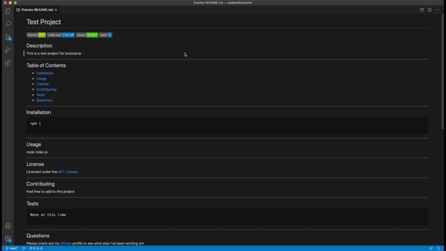

# Readme Generator

 [](https://github.com/jdbell123/readmeGenerator/issues)
 [](https://github.com/jdbell123/readmeGenerator/stargazers)
## Table of Contents

* [Reason](#reason)
* [Learnt](#learnt)
* [Take-Aways](#Take-Aways)
* [Installation](#installation)
* [Usage](#usage)
* [Credits](#credits)
* [License](#license)
* [Links](#links)

***

## Reason

The reason for this assignment this week was to learn mainly about NodeJS. We were given the following User Story and Acceptance Criteria:

```
AS A developer
I WANT a README generator
SO THAT I can quickly create a professional README for a new project
```

```
GIVEN a command-line application that accepts user input
WHEN I am prompted for information about my application repository
THEN a high-quality, professional README.md is generated with the title of my project and sections entitled Description, Table of Contents, Installation, Usage, License, Contributing, Tests, and Questions
WHEN I enter my project title
THEN this is displayed as the title of the README
WHEN I enter a description, installation instructions, usage information, contribution guidelines, and test instructions
THEN this information is added to the sections of the README entitled Description, Installation, Usage, Contributing, and Tests
WHEN I choose a license for my application from a list of options
THEN a badge for that license is added near the top of the README and a notice is added to the section of the README entitled License that explains which license the application is covered under
WHEN I enter my GitHub username
THEN this is added to the section of the README entitled Questions, with a link to my GitHub profile
WHEN I enter my email address
THEN this is added to the section of the README entitled Questions, with instructions on how to reach me with additional questions
WHEN I click on the links in the Table of Contents
THEN I am taken to the corresponding section of the README
```

---

## Learnt

Working on this project I have learnt about the following things:

    1 - NodeJS
    2 - NPM
    3 - Expanded knowledge on JavaScript
    4 - Expanded knowledge on formatting of readme files and the format of them

---

## Take-Aways

Working with a command line application was different to what we had worked on before. Some of the same things/methods that we have learnt to date still applied though. Build slowly and run your code often. Commit as often as you can and remember to. Also, read over the homework readme file at least two times - to make sure you don't miss anything.

---

## Installation

This is a command line application and requires the inquirer to be installed. To install the required code use the following command on your command line:
```
npm i
```
At present the application will create the readme file in a folder called "generated".

---

## Usage 

To invoke this application type the following on your command line:
```
node index.js
```

Here is a walkthrough of the application in action.


This is the generated README.MD file from the walkthrough above.



---

## Credits

As always thanks to my BFF Google for being there in my hours of need. Also, to my fellow class mates for the study groups and hints/tips I received on this project. Last but not least a thank you to the tutor and TAs for the guidance and support they gave on this project. 

---

## License


Licensed under the [MIT](./LICENSE) license.


---

## Links

[GitHub Repo](https://github.com/jdbell123/readmeGenerator)

[Website](https://jdbell123.github.io/readmeGenerator/)